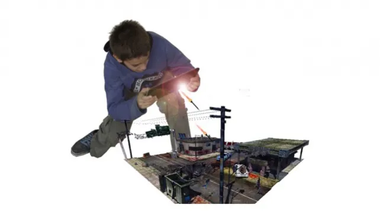
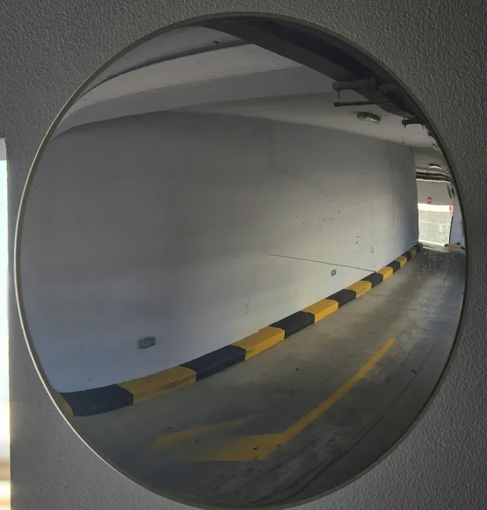
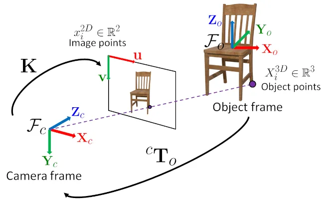

# 3D Pose Estimation

Imagine you are watching a video of a car on your screen. You see a flat, 2D image, but your brain instinctively understands that the car is a three-dimensional object existing in the real world. 3D pose estimation is the process of teaching a computer to make that same leap: to determine an object's precise 3D position and orientation from a 2D image.

This process creates a mathematical bridge between the 3D world and the 2D image. It involves a few key steps:

1.  **Calibrating the Camera:** First, we need to understand the unique characteristics of our camera and how its lens views the world.
2.  **Finding a Reference:** Next, we introduce a known pattern, like a checkerboard, into the scene to serve as a real-world anchor point.
3.  **Projecting Points:** Finally, we use this information to calculate exactly where any 3D point on our object will appear in the 2D image.


This is the fundamental concept that powers augmented reality, allowing a virtual character to look like it's standing right in your room. An example using this technique is the mobile game [Table zombies](https://www.youtube.com/watch?v=OZzaAQ3e9fU).




The whole code for this experiment can be found in this repository + some sample images that are needed for the camera calibration. I'm also attaching the weights of my camera, so you can directly run the second notebook and play with it as well as use your own images and construct your 3D scenes.

# Camera Calibration



Every camera lens has flaws. It subtly bends the light passing through it, which causes distortion, similar to the effect of a funhouse mirror. Without accounting for these specific flaws, any 3D calculations would be inaccurate.

Calibration is the process of measuring these imperfections along with the camera's internal properties. The result is a set of correction values that let us undo the distortion, allowing us to treat our camera as a perfect, mathematical pinhole model.

Through calibration, we obtain four key parameters: `mtx`, `dist`, `rvecs`, and `tvecs`. The first two are the _intrinsic_ parameters of the camera, as they are fixed based on its physical construction. The last two are the _extrinsic_ parameters, which describe how the reference object (like a checkerboard) is positioned relative to the camera. These parameters are essential for the process known as 3D reconstruction.

Getting rid of radial distortion is fundamental, since if we don't have it, we can prove that a line in the 3D space will still be a line in the 2D image. I won't get into the details of how camera calibration works, but the article of [Zhang's calibration method](https://www.microsoft.com/en-us/research/wp-content/uploads/2016/02/tr98-71.pdf) is a mandatory read if you want to fully understand this process.

### `mtx` — Camera Matrix (Intrinsic)

Think of the camera matrix as the camera's birth certificate. It describes its fixed, internal characteristics, namely its focal length (how "zoomed in" it is) and the optical center (the true center of its sensor). This matrix is the key to translating between **real-world units**, like centimeters, and **image units**, which are pixels.

The camera matrix is a 3×3 grid of numbers that defines how the camera projects 3D points onto its 2D image plane.

$$
mtx =
\begin{bmatrix}
f_x & 0 & c_x \\
0 & f_y & c_y \\
0 & 0 & 1
\end{bmatrix}
$$

In this matrix, **$f_x$** and **$f_y$** represent the focal lengths in pixel units, while **$c_x$** and **$c_y$** define the optical center, which is usually close to the center of the image.

### `dist` — Distortion Coefficients (Intrinsic)

This array of coefficients models how the lens distorts the image. Most lenses are not perfect, causing effects like radial distortion, which makes straight lines near the edges of an image appear curved. These coefficients are used to correct those imperfections.

A typical set of distortion coefficients in OpenCV includes five values:

$$
dist = [k_1, k_2, p_1, p_2, k_3]
$$

Here, **$k_1$, $k_2$,** and **$k_3$** correct for radial distortion, while **$p_1$** and **$p_2$** correct for tangential distortion, which occurs when the lens is not perfectly parallel to the image sensor.

### `rvecs` — Rotation Vectors (Extrinsic)

This is a list containing a rotation vector for each calibration image. Each vector, or `rvec`, describes the **rotation** of the calibration pattern (e.g., the checkerboard) in relation to the camera. In essence, it tells us how the world's coordinate system is oriented from the camera's perspective.

This vector can be converted into a more familiar 3×3 rotation matrix using OpenCV's Rodrigues function:

```python
R, _ = cv2.Rodrigues(rvec)
```

### `tvecs` — Translation Vectors (Extrinsic)

Similar to the rotation vectors, this is a list of translation vectors, one for each calibration image. Each `tvec` describes the **3D position** of the calibration pattern's origin relative to the camera's origin.

Together, the rotation matrix (`R`) and the translation vector (`tvec`) define the camera's **pose**, which is its complete position and orientation relative to the calibration object. This combined transformation is often represented as a 3×4 matrix, `[R | t]`.

# Point Projection



While OpenCV's API simplifies this process with a function called `projectPoints`, it's interesting to look at the linear algebra that makes it work.

To implement this manually, we need a way to convert a point from world coordinates, such as $X_w = (x, y, z)$ in millimeters, to a point in image coordinates, $X_i = (x, y)$ in pixels. Because the only non-linear element in our model is the lens distortion (which we've already corrected for), we can project a 3D point into our 2D picture using straightforward linear algebra.

### Summary of the Transformation

The entire transformation from a 3D world point to a 2D image point can be summarized in a single equation:

$$
X_{i} = K \cdot [R | t] \cdot X_{w}
$$

Here is what each term represents:

- $K$ is the intrinsic camera matrix.
- $[R | t]$ is the extrinsic matrix combining rotation and translation.
- $X_{w}$ is the 3D point in homogeneous coordinates, written as `[X, Y, Z, 1]`.
- $X_{i}$ is the resulting 2D point on the image.

### A Note on Homogeneous Coordinates

You might wonder why we add a `1` to our 3D point `[X, Y, Z]` to make it `[X, Y, Z, 1]`. This is a clever mathematical trick that makes our lives much easier. To move an object in 3D space, you need to rotate it and then translate it (move it). This would typically require two separate operations: a matrix multiplication for the rotation and a vector addition for the translation.

By adding that extra `1`, we convert a transformation that would be affine (multiplication plus addition) into one that is purely linear (a single matrix multiplication). This is more elegant and efficient for several key reasons:

1.  **Composition of Transformations:** In graphics and robotics, objects undergo multiple transformations. Without homogeneous coordinates, applying a rotation, then a translation, then a scaling would be algebraically messy. With them, we can combine all these steps into a single matrix by simply multiplying them together: `M_total = M_scale * M_translate * M_rotate`. This final matrix can then be applied to every point in the object, which is far more efficient.

2.  **Inverting Transformations:** We often need to reverse a transformation, for example, to find where a mouse click on a 2D screen exists in the 3D world. Inverting an affine transformation is a two-step process. In contrast, if the entire transformation is a single matrix `M`, its inverse is simply the matrix inverse `M⁻¹`, which allows us to use standard, optimized linear algebra routines.

3.  **Unified Framework:** This approach provides a consistent mathematical framework for all rigid transformations. Rotation, translation, and scaling are all handled as a single type of operation: matrix multiplication. This simplifies the design of software and hardware, which is why modern GPUs are highly optimized to perform these calculations at incredible speeds.

### Full Code of the Projection

The following code implements the projection transformation we just discussed. We will go through it line-by-line to understand how each operation is performed.

```python
def project_points(object_points, rvec, tvec, camera_matrix):
    # Convert the rotation vector into a rotation matrix
    R, _ = cv2.Rodrigues(rvec)

    # Combine the rotation matrix and translation vector to form the extrinsic matrix
    Rt = np.hstack([R, tvec.reshape(3, 1)]) # Results in a 3×4 matrix

    # Create the full 3x4 projection matrix
    P = camera_matrix @ Rt

    # Convert the 3D object points to homogeneous coordinates
    object_points_h = np.hstack([object_points, np.ones((object_points.shape[0], 1))])

    # Perform the projection
    proj_h = (P @ object_points_h.T).T

    # Normalize by the third coordinate to get 2D image points
    proj_2d = proj_h[:, :2] / proj_h[:, 2:]

    return proj_2d
```

#### 1. Convert `rvec` to a Rotation Matrix

`R, _ = cv2.Rodrigues(rvec)`

OpenCV stores rotations efficiently as a 3D rotation vector (`rvec`), which encodes both the axis and angle of rotation. This line uses the `cv2.Rodrigues` function to convert that vector into a standard 3×3 rotation matrix (`R`), which defines the orientation of the world relative to the camera.

#### 2. Build the `[R|t]` Matrix

`Rt = np.hstack([R, tvec.reshape(3, 1)])`

Here, we concatenate the 3x3 rotation matrix and the 3x1 translation vector into a single 3×4 extrinsic matrix. This matrix maps points from the world coordinate system to the camera's coordinate system.

#### 3. Compute the Full Projection Matrix

`P = camera_matrix @ Rt`

This line multiplies the intrinsic camera matrix (`K`) by the extrinsic matrix (`[R|t]`) to create the final 3×4 projection matrix, `P`. This single matrix can now map 3D world points directly to 2D homogeneous image coordinates.

#### 4. Convert 3D Points to Homogeneous Coordinates

`object_points_h = np.hstack([object_points, np.ones((object_points.shape[0], 1))])`

To use our 3×4 projection matrix, we must first convert our 3D input points from `[X, Y, Z]` to homogeneous coordinates by adding a `1`, making them `[X, Y, Z, 1]`.

#### 5. Perform the Projection

`proj_h = (P @ object_points_h.T).T`

This is where the core projection happens. We multiply the projection matrix `P` by our homogeneous 3D points. The result is a set of points in homogeneous image coordinates `[u', v', w']`.

#### 6. Normalize to get 2D Coordinates

`proj_2d = proj_h[:, :2] / proj_h[:, 2:]`

To get our final 2D pixel coordinates, we perform a step called perspective division. We divide the first two components of our homogeneous image coordinates (`u'` and `v'`) by the third component (`w'`). This converts the points into their final `(u, v)` pixel locations on the image.

#### Output

The function returns `proj_2d`, which is an array of shape `(N, 2)`, where each row contains the projected `(u, v)` pixel coordinate of the corresponding 3D point.

### Sample coordinates for the projection

In the code, we use the sample coordinates `axis = np.float32([[3, 0, 0], [0, 3, 0], [0, 0, -3]])` for projection. These are 3D coordinates `(x, y, z)` defined in a measurement unit relative to the checkerboard pattern.

For example, the point `[3, 0, 0]` represents a location that is three checkerboard squares along the x-axis from the origin.

You'll notice the z-coordinate is negative (`-3`). This is because of OpenCV's coordinate system convention. Positive 'z' values extend *away* from the camera's viewpoint. By using a negative value, we ensure the projected z-axis points *outward* from the checkerboard, rather than appearing to go into the page.

# Resources

- [OpenCV: Pose Estimation](https://docs.opencv.org/4.x/d7/d53/tutorial_py_pose.html)
